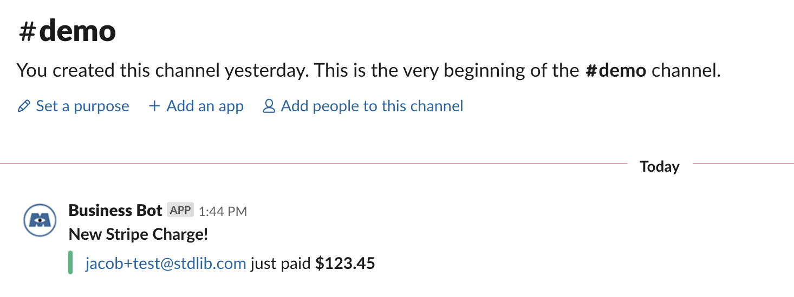

# Stripe Charge Slack Bot

This is a Slack bot that stores information about new Stripe charges in Airtable and sends an alert to a Slack channel. It is written in Node.js and uses [Build on Standard Library](https://build.stdlib.com).

## Setup

1. First, go to https://airtable.com/addBaseFromShare/shrMvMavY2FDCtnL4 to add a copy of the required Airtable base to your Airtable workspace.
2. Click the "Deploy to Standard Library" button above and link the required accounts. For Airtable, make sure you select the base you just copied, and for Slack, use the default option. We also recommend using a fresh test Slack workspace rather than an active one –– you can create one [here](https://slack.com/create#email).
3. Follow the prompt to test your project. You should see a dummy charge in your Airtable base and Slack channel!

## Creating a Test Invoice in Stripe

1. Click ship. You can then go to your [Stripe dashboard](https://dashboard.stripe.com/test/customers) under *Customers* and create a customer for a test email you own.
2. Go to [Billing -> Invoices](https://dashboard.stripe.com/test/invoices) and create a test invoice to the customer you just created. Check your email and pay the invoice. You should see an alert appear in your Slack channel!

## Shipping to Production

When you're satisfied with your bot, shipping to production is straightforward!

1. Open your project in [Build on Standard Library](https://build.stdlib.com) and click the "Ship to Production" button.
2. Link new *production* resources. You will want to create a new Airtable base from the [template](https://airtable.com/addBaseFromShare/shrMvMavY2FDCtnL4).

# Thank You!

Please check out [Standard Library](https://stdlib.com/) or follow us on Twitter,
[@StdLibHQ](https://twitter.com/@StdLibHQ).
